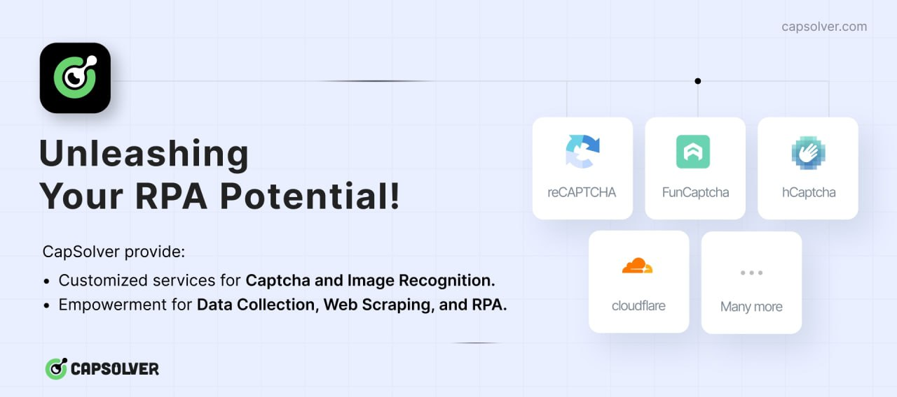

# funcaptcha challenger

## Introduction

`Funcaptcha challenger` is a free python library that provides a simple interface to solve FunCaptcha challenges.

## Sponsors

### [Capsolver](https://capsolver.com?utm_source=github&utm_medium=banner_github&utm_campaign=funcaptcha_challenger)

[](https://capsolver.com?utm_source=github&utm_medium=banner_github&utm_campaign=funcaptcha_challenger)

[Capsolver.com](https://www.capsolver.com/?utm_source=github&utm_medium=banner_github&utm_campaign=funcaptcha_challenger)
is an AI-powered service that specializes in solving various types of captchas automatically. It supports captchas such
as [reCAPTCHA V2](https://docs.capsolver.com/guide/captcha/ReCaptchaV2.html), [reCAPTCHA V3](https://docs.capsolver.com/guide/captcha/ReCaptchaV3.html), [hCaptcha](https://docs.capsolver.com/guide/captcha/HCaptcha.html), [FunCaptcha](https://docs.capsolver.com/guide/captcha/FunCaptcha.html), [DataDome](https://docs.capsolver.com/guide/captcha/DataDome.html), [AWS Captcha](https://docs.capsolver.com/guide/captcha/awsWaf.html), [Geetest](https://docs.capsolver.com/guide/captcha/Geetest.html),
and
Cloudflare [Captcha](https://docs.capsolver.com/guide/antibots/cloudflare_turnstile.html) / [Challenge 5s](https://docs.capsolver.com/guide/antibots/cloudflare_challenge.html), [Imperva / Incapsula](https://docs.capsolver.com/guide/antibots/imperva.html),
among others.

For developers, Capsolver offers API integration options detailed in their [documentation](https://docs.capsolver.com/),
facilitating the integration of captcha solving into applications. They also provide browser extensions for
both [Chrome](https://chromewebstore.google.com/detail/captcha-solver-auto-captc/pgojnojmmhpofjgdmaebadhbocahppod)
and [Firefox](https://addons.mozilla.org/es/firefox/addon/capsolver-captcha-solver/), making it easy to use their
service directly within a browser. Different pricing packages are available to accommodate varying needs, ensuring
flexibility for users.

## Supported challenges

| variant                       | instruction                                                                                       |                                                                              
|-------------------------------|---------------------------------------------------------------------------------------------------|
| 3d_rollball_animals           | Use the arrows to rotate the animal to face in the direction of the hand                          |
| 3d_rollball_objects           | Use the arrows to rotate the object to face in the direction of the hand                          |
| hopscotch_highsec             | Use the arrows to move the person to the icon indicated by the colored circle                     |                                                                                          
| coordinatesmatch              | Using the arrows, move the person to the indicated seat                                           |       
| train_coordinates             | Use the arrows to move the train to the coordinates indicated in the left image                   |
| BrokenJigsawbrokenjigsaw_swap |                                                                                                   | 
| shadows                       | Pick the wrong shadow                                                                             |
| penguins                      | Pick the penguin                                                                                  |
| frankenhead                   | Select the animal with the wrong head                                                             |
| counting                      | Pick the image where the number matches the amount of animals                                     |
| knotsCrossesCircle            | Pick the image with 3 circles in a row in any                                                     |
| hand_number_puzzle            | Select the image where the total fingers add up to 4                                              |
| card                          | Pick the matching cards                                                                           |
| rockstack                     | Using the arrows, pick the group of rocks that has the amount indicated on the left               | 
| cardistance                   | use the arrows to find the distance between the two cars that matches the left image              | 
| penguins-icon                 | Pick the penguin                                                                                  | 
| conveyor                      | use the arrows to pick the image where the object directly below the arrow matches the left image | 
| unbentobjects                 | Pick the object that is not distorted                                                             | 

## Installation

```bash
pip install funcaptcha-challenger
```

## Usage

[demo for 3d_rollball_objects](demo/3d_rollball_animals_demo.py)

for more examples see [demo](demo)

## Discussion

- 📱 [Telegram](https://t.me/+shEEyNIEe55lN2Rl)

## Support Me

If this project has helped you save costs or has been beneficial in any way, consider supporting it by buying me a
coffee. Your donation can go a long way in helping me maintain and improve this project. Thank you for your support!

- USDT-TRC20: TNU6Lecqzu6d9fVsyvMdtFsuX5PUho5wZi

